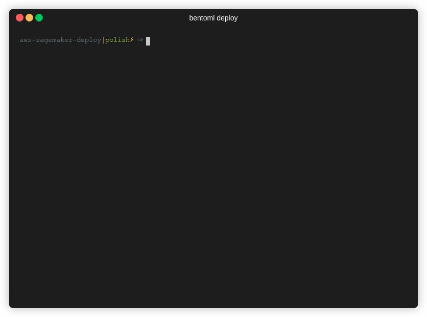

# AWS Sagemaker deployment tool

[](https://shields.io/)

Sagemaker is a fully managed service for building ML models. BentoML provides great support
for deploying BentoService to AWS Sagemaker without the additional process and work from users. With BentoML, users can enjoy the performance of Sagemaker with any popular ML frameworks.

<p align="center">
  
</p>

## Prerequisites

- An active AWS account configured on the machine with AWS CLI installed and configured
    - Install instruction: https://docs.aws.amazon.com/cli/latest/userguide/cli-chap-install.html
    - Configure AWS account instruction: https://docs.aws.amazon.com/cli/latest/userguide/cli-chap-configure.html
- Docker is installed and running on the machine.
    - Install instruction: https://docs.docker.com/install
- Install required python packages
    - `$ pip install -r requirements.txt`


## Quickstart

You can try out the deployment script with the IrisClassifier for the iris dataset that is given in the [BentoML quick start guide](https://github.com/bentoml/BentoML/blob/master/guides/quick-start/bentoml-quick-start-guide.ipynb)

1. Build and save Bento Bundle from [BentoML quick start guide](https://github.com/bentoml/BentoML/blob/master/guides/quick-start/bentoml-quick-start-guide.ipynb)

2. Copy and change the [sample config file](sagemaker_config.json) given and change it according to your deployment specifications. Check out the [config section](#configuration-options) to find the differenet options.

3. Create Sagemaker deployment with the deployment tool. 
   
   Run deploy script in the command line:

    ```bash
    $ BENTO_BUNDLE_PATH=$(bentoml get IrisClassifier:latest --print-location -q)
    $ python deploy.py $BENTO_BUNDLE_PATH my-sagemaker-deployment sagemaker_config.json
    ```

    Get Sagemaker deployment information and status

    ```
    $ python describe.py my-sagemaker-deployment

    # Sample output
    {
    │   'StackId': 'arn:aws:cloudformation:ap-south-1:213386773652:stack/iristest-endpoint/edd9d500-095c-11ec-bc08-06418f3882f0',
    │   'StackName': 'iristest-endpoint',
    │   'StackStatus': 'CREATE_COMPLETE',
    │   'CreationTime': '08/30/2021, 06:38:47',
    │   'LastUpdatedTime': '08/30/2021, 06:38:52',
    │   'OutputApiId': '2f5qtdd2rf',
    │   'EndpointURL': 'https://2f5qtdd2rf.execute-api.ap-south-1.amazonaws.com/prod',
    │   'api_name': 'predict'
    }
    ```

4. Make sample request against deployed service. The url for the endpoint given in the output of the describe command or you can also check the API Gateway through the AWS console.

    ```bash
    $ curl -i \
        --header "Content-Type: application/json" \
        --request POST \
        --data '[[5.1, 3.5, 1.4, 0.2]]' \
        yr3v9vh407.execute-api.ap-south-1.amazonaws.com/prod/predict

    # Sample Output
    HTTP/1.1 200 OK
    Connection: keep-alive
    Content-Type: application/json
    X-Request-Id: f499b6d0-ad9b-4d79-850a-3dc058bd67b2
    Content-Length: 3
    Date: Mon, 28 Jun 2021 02:50:35 GMT
    Server: Python/3.7 aiohttp/3.7.4.post0
    Via: 1.1 vegur

    [0]%
    ```

5. Delete Sagemaker deployment

    ```bash
    python delete.py my-sagemaker-deployment
    ```

## Deployment operations

### configuration options

A sample configuration file has been given has been provided [here](sagemaker_config.json). Feel free to copy it over and change it for you specific deployment values

* `api_name`: User-defined API function for the inference
* `timeout`: timeout for API request in seconds
* `workers`: Number of workers for Bento API server
* `region`: AWS region where Sagemaker endpoint is deploying to
* `iam_role`: (optional) if provided with an AWS Role name, that role will be
used for creating the Sagemaker endpoint. Make sure this Role has
AmazonSagemakerFullAccess and ECR - BatchGetImage permissions. If this option is
not provided a role with the sagemaker permissions will be selected for you
(based on the roles in your aws-cli profile).
* `instance_type`: The ML compute instance type for Sagemaker endpoint. See https://docs.aws.amazon.com/cli/latest/reference/sagemaker/create-endpoint-config.html for available instance types
* `initial_instance_count`: Number of instances to launch initially.
* `enable_data_capture`: Enable Sagemaker capture data from requests and responses and store the captured data to AWS S3
* `data_capture_s3_prefix`: S3 bucket path for store captured data
* `data_capture_sample_percent`: Percentage of the data will be captured to S3 bucket.

### Create a new deployment

Use Command line

```bash
python deploy.py <BENTO_BUNDLE_PATH> <DEPLOYMENT_NAME> <CONFIG_JSON default is ./sagemaker_config.json>
```

For example:

```bash
$ MY_BUNDLE_PATH=$(bentoml get IrisClassifier:latest --print-location -q)
$ python deploy.py $MY_BUNDLE_PATH my_deployment --config_json sagemaker_config.json
```

Use Python API

```python
from deploy import deploy_to_sagemaker

deploy_to_sagemaker(BENTO_BUNDLE_PATH, DEPLOYMENT_NAME, CONFIG_JSON)
```

To create and push a model image to ECR without deploying the stack, use the flag `--skip_stack_deployment`

### Update an existing deployment

Use Command Line
```bash
python update.py <DEPLOYMENT_NAME> <BENTO_BUNDLE_PATH> <API_NAME> <CONFIG_JSON default is sagemaker_config.json>
```


Use Python API

```python
from update import update_deployment

update_deployment(BENTO_BUNDLE_PATH, DEPLOYMENT_NAME, CONFIG_JSON)
```

### Describe deployment status and information

Use Command line

```bash
python get.py <DEPLOYMENT_NAME>
```


Use Python API

```python
from describe import describe_deployment
describe_deployment(DEPLOYMENT_NAME)
```

### Delete deployment

Use Command line

```bash
python delete.py <DEPLOYMENT_NAME>
```

Use Python API

```python
from delete import delete_deployment

delete_deployment(DEPLOYMENT_NAME)
```
